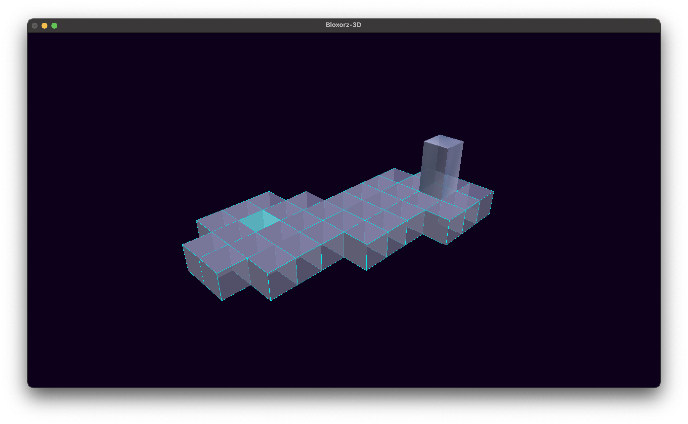
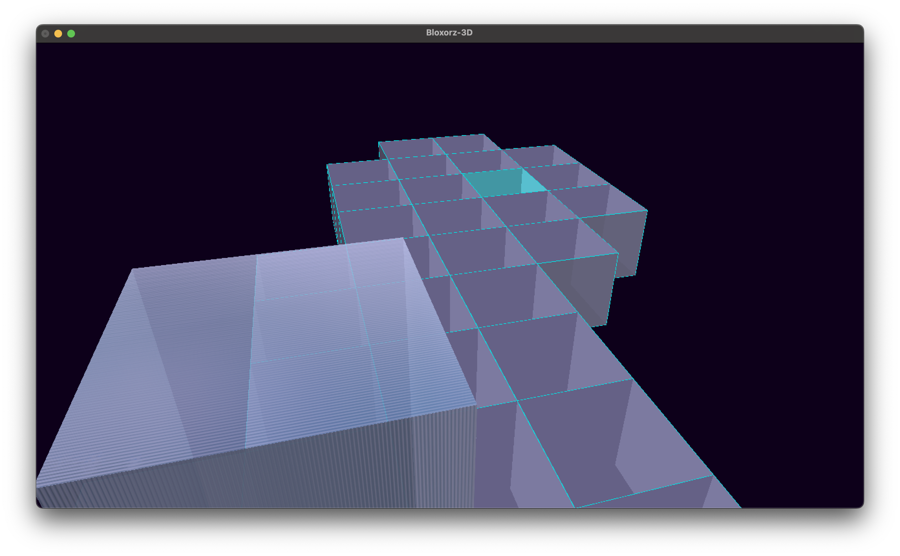

# Bloxorz 3D - Mid Review

A 3D implementation of the classic puzzle game **Bloxorz**.

---

## Platform Block States

| Code | Description            |
|------|------------------------|
| 0    | Empty space            |
| 1    | Normal block           |
| 2    | Target block           |
| 3    | Fragile tile (TODO)    |
| 4    | Toggle tile (bridge)   |
| 5    | Toggle action tile     |
| 9    | Starting position      |

---

## Camera Controls

- **W** → Zoom in  
- **S** → Zoom out  
- **A** → Rotate right  
- **D** → Rotate left  
- **1** → Preset camera angle 1  
- **2** → Preset camera angle 2  

---

## Run
Compile using
```bash
clang++ main.cpp menu.cpp win.cpp levels.cpp dependencies/include/SOIL2/SOIL2.c dependencies/include/SOIL2/image_DXT.c dependencies/include/SOIL2/image_helper.c dependencies/include/SOIL2/wfETC.c -o Bloxorz-3D -std=c++11 -I dependencies/include -framework CoreFoundation -framework GLUT -framework OpenGL
```
---

## Run roll.cpp
Compile using
```bash
/usr/bin/clang++ -std=gnu++14 -std=c++17 -fdiagnostics-color=always -Wall -g /Users/anukahettiarachchi/Documents/GitHub/bloxorz-3D-mid-review/roll.cpp -o /Users/anukahettiarachchi/Documents/GitHub/bloxorz-3D-mid-review/roll -I/opt/homebrew/include -I/opt/homebrew/include/GL -L/opt/homebrew/lib -lglfw -lGLEW -framework OpenGL -framework GLUT -framework Cocoa -framework IOKit -framework CoreVideo -Wno-deprecated
```
---
## Notes

### Platform and Block



### Texture



### Movement


